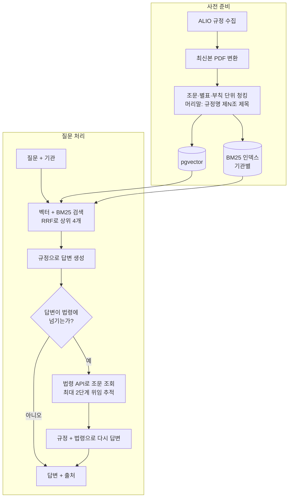

# Intra QA — 사내 규정 QA 어시스턴트

공공기관 직원이 인사·복무·보수·출장·복리후생에 관해 물으면, 소속 기관의 내부규정에서 근거를 찾아 **조문 출처와 함께** 답하는 RAG 시스템입니다. 규정이 "근로기준법에 따른다"처럼 법령에 맡긴 내용은 국가법령정보 OPEN API로 해당 조문을 찾아 함께 답합니다.

```text
Q. 출산휴가는 며칠 쓸 수 있어?

[규정 검색] 취업규칙 제27조: "출산전후휴가: 근로기준법에서 정한 휴가일수를 적용"
[법령 조회] 근로기준법 제74조(임산부의 보호)

A. 출산휴가는 근로기준법에서 정한 바에 따라 90일(미숙아를 출산한 경우에는 100일, 한 번에 둘 이상
   자녀를 임신한 경우에는 120일)입니다. 이 경우 휴가 기간의 배정은 출산 후에 45일(한 번에 둘 이상
   자녀를 임신한 경우에는 60일) 이상이 되어야 합니다. (취업규칙 제27조, p.6-7; 근로기준법 제74조)
```
위 답변은 평가 결과(`results/structured_hybrid_law_v2/details.csv`, Q34)의 실제 출력입니다.

## 1. 문제 정의

**한 문장 정의:** 공공기관 내부규정을 근거로 인사·복무·보수·출장·복리후생 질문에 답하는 RAG

| 항목 | 내용 |
| --- | --- |
| 누가 질문하는가 | 기관 소속 직원 (신입, 관리자 포함) |
| 무엇을 검색하는가 | 소속 기관의 내부규정. 규정이 법령에 맡긴 내용은 상위 법령 |
| 어디까지 답하는가 | 규정에 명시된 기준, 금액, 기간, 절차, 조건과 예외 |
| 근거가 없으면 | "규정에서 근거를 찾을 수 없습니다. 담당 부서에 문의해 주세요."로 답하고 추측하지 않음 |

직원이 "출장 일비가 얼마인지" 하나를 확인하려 해도 여비규정 본문과 별표를 함께 찾아야 하고, 규정이 근로기준법에 맡긴 내용은 법령까지 따라가야 합니다. 일상 표현("밥값", "와이프")과 규정 용어("식비", "배우자")가 달라 검색도 어렵습니다.

## 2. 사용 데이터

| 데이터 | 출처 | 범위 |
| --- | --- | --- |
| 내부규정 | [ALIO 공공기관 내부규정](https://www.alio.go.kr/occasional/ruleList.do) | 한국지역난방공사 규정 37종 (개정본 포함 190개 파일 수집, 최신본 37개를 검색 대상으로 사용) |
| 상위 법령 | [국가법령정보 공동활용 OPEN API](https://open.law.go.kr) | 질의 시점에 필요한 조문만 조회 (근로기준법, 같은 법 시행령, 근로자퇴직급여 보장법 등) |

- 규정 원문은 HWP/HWPX이며, LibreOffice + H2Orestart로 PDF로 변환해 표(별표)를 보존합니다.
- 수집 데이터(`data/`)는 저장소에 포함하지 않습니다. 아래 실행 방법의 수집·변환 명령으로 다시 만들 수 있습니다.
- 규정은 수집 시점(2026-10-02) 기준입니다.

## 3. RAG 구조

최종 파이프라인 `structured_hybrid_law`의 흐름입니다.



| 구성 | 선택 |
| --- | --- |
| 언어·환경 | Python 3.12, uv |
| 프레임워크 | LangChain |
| LLM | 답변 `gpt-4o-mini`, 법령 조문 선택 `gpt-5.4-mini` |
| 임베딩 | `text-embedding-3-small` |
| 벡터 저장소 | PostgreSQL 16 + pgvector (`langchain-postgres`) |
| 키워드 검색 | rank-bm25 + kiwipiepy 형태소 분석 |
| 평가 채점 | `gpt-5.4-mini` (답변 모델과 분리) |

각 단계는 교체 가능한 모듈이고, `src/rag/pipelines.py`에 조합을 이름으로 등록합니다.

| 파이프라인 | 청킹 | 검색 | 법령 재검색 |
| --- | --- | --- | --- |
| `baseline` | 페이지 단위 1000자 | 벡터 | - |
| `hybrid` | 페이지 단위 1000자 | 벡터 + BM25 | - |
| `structured` | 조문 단위 | 벡터 | - |
| `structured_hybrid` | 조문 단위 | 벡터 + BM25 | - |
| `structured_hybrid_law` | 조문 단위 | 벡터 + BM25 | 답변 기반 조회 |

```text
src/
├── lib/       config.py, store.py, check_env.py           공통 설정, 벡터 저장소 연결, 환경 점검
├── collect/   collect_rules.py, convert_latest.py         규정 수집, 최신본 PDF 변환
├── rag/       ingest.py, chunking.py, bm25.py, retrieve.py,
│              law.py, corrective.py, rag.py, pipelines.py RAG 본체와 모듈
└── eval/      evaluate.py, compare.py                     평가, 결과 비교
eval/questions.csv                                         평가 질문 36개
results/                                                   파이프라인별 평가 결과
```

## 4. 설치 방법

**필요한 것:** Python 3.12, [uv](https://docs.astral.sh/uv/), Docker, OpenAI API 키, 국가법령정보 OPEN API 인증키(OC)

규정을 직접 수집·변환하려면 추가로 LibreOffice와 H2Orestart 확장이 필요합니다.

```bash
# 1. 의존성
uv sync

# 2. 환경 변수: OPENAI_API_KEY, LAW_OC 입력
cp .env.example .env

# 3. pgvector (localhost:5445)
docker compose up -d

# 4. 연결 점검: DB, OpenAI, 법령 API
uv run python -m src.lib.check_env
```

```bash
# (규정 수집·변환을 할 경우) LibreOffice + H2Orestart
brew install --cask libreoffice
gh release download -R ebandal/H2Orestart -p H2Orestart.oxt
/Applications/LibreOffice.app/Contents/MacOS/unopkg add H2Orestart.oxt
```

## 5. 실행 방법

```bash
# 1. 규정 수집 (개정본 포함, data/raw/, data/manifest.csv)
uv run python -m src.collect.collect_rules 한국지역난방공사

# 2. 최신본 PDF 변환 (data/pdf/)
uv run python -m src.collect.convert_latest

# 3. 벡터 적재 (청킹 방식마다 컬렉션이 따로 생김)
uv run python -m src.rag.ingest --index baseline
uv run python -m src.rag.ingest --index structured

# 4. 질문하기: 검색 문서, 법령 조회 과정, 답변 출력
uv run python -m src.rag.rag "출산휴가는 며칠 쓸 수 있어?" --pipeline structured_hybrid_law

# 검색 결과만 확인
uv run python -m src.rag.retrieve "여비규정 제13조 내용은?" --method hybrid --index structured
```

```bash
# 평가: results/<파이프라인>/ 에 details.csv, summary.md 저장
uv run python -m src.eval.evaluate --pipeline structured_hybrid_law

# 여러 결과 비교: results/evaluation.md (첫 번째가 기준)
uv run python -m src.eval.compare baseline hybrid structured structured_hybrid structured_hybrid_law structured_hybrid_law_v2
```

Python에서는 `ask()` 함수 하나로 호출합니다. 기관은 인자로 받으며, 검색 단계에서 해당 기관 문서로만 필터링합니다.

```python
from src.rag.rag import ask

result = ask("출산휴가는 며칠 쓸 수 있어?", org="한국지역난방공사", pipeline="structured_hybrid_law")
result["answer"], result["sources"], result["trace"]
```

## 6. 테스트 질문

`eval/questions.csv`에 36개 질문을 직접 작성했습니다. 주요 규정 5개를 읽고 정답과 근거 페이지를 적었으며, 각 정답 페이지에 해당 조문과 핵심 값이 있는지 스크립트로 확인했습니다. 상위법 문항의 정답은 법령 API로 현행 조문을 조회해서 작성했습니다.

| 유형 | 문항 | 예시 |
| --- | --- | --- |
| 명확 | 7 | 직원 보수 지급일은 매월 며칠인가? |
| 표현다름 | 6 | 집에서 일해도 돼? |
| 표 | 6 | 1급 이하 직원이 서울로 출장 가면 숙박비 상한은? |
| 조문번호 | 4 | 여비규정 제13조 내용은? |
| 조건·예외 | 4 | 수습 기간에도 상여금을 받을 수 있나? |
| 복합 | 3 | 본인 결혼휴가와 배우자 출산휴가는 각각 며칠인가? |
| 상위법 | 3 | 출산휴가는 며칠 쓸 수 있어? |
| 문서없음 | 3 | 사내 주차 요금은 얼마인가? |

**평가 지표**

| 구분 | 지표 | 방법 |
| --- | --- | --- |
| 검색 | Hit Rate@4, MRR | 정답 규정·페이지가 상위 4개 안에 있는가, 몇 번째인가 |
| 답변 | key_facts 통과 | 답변에 꼭 들어가야 할 값(일수, 금액 등)이 모두 있는가 |
| 답변 | 출처 조문 정확도 | 답변이 정답 조문번호를 인용했는가 |
| 답변 | LLM 채점 정답 | 정답 기준과 의미가 맞는가 (답변 모델과 다른 모델로 채점) |
| 거절 | 잘못된 거절 | 답이 있는데 "찾을 수 없음"으로 답했는가 |

## 7. Baseline 결과

페이지 단위 청킹 + 벡터 검색. 상세: [`results/baseline/`](results/baseline/)

| Hit@4 | 출처 조문 정확도 | LLM 정답 | 잘못된 거절 | 상위법 정답 |
| --- | --- | --- | --- | --- |
| 61% | 26% | 44% | 30% | 0/3 |

발견한 문제:

- **조문번호·키워드를 못 찾음:** "여비규정 제13조"를 물으면 부칙 페이지를 가져옴. 조문번호 유형 정답 0/4
- **출처 조문번호를 지어냄:** 청크에 조문 머리말이 없어 제13조 내용을 "제2조"로 표기
- **조문이 페이지 경계에서 잘림:** 배우자 출산휴가(제27조, p.5~6)를 못 찾음
- **비슷한 규정끼리 섞임:** 직원보수규정(70%/50%)과 직원연봉보수규정(60%/40%)을 "70%, 40%"로 섞어 답함
- **법령에만 답이 있음:** "근로기준법에서 정한 휴가일수를 적용"까지만 답함
- 근거 없는 질문은 100% 거절했지만, **검색이 실패하면 답이 있는 질문도 거절**(30%)

## 8. 개선 방법과 결과

관찰한 문제마다 개선을 하나씩 적용하고 같은 36문항으로 다시 측정했습니다. 전체 비교: [`results/evaluation.md`](results/evaluation.md)

| 파이프라인 | 바꾼 것 | Hit@4 | 출처 조문 정확도 | key_facts | LLM 정답 | 잘못된 거절 | 상위법 정답 |
| --- | --- | --- | --- | --- | --- | --- | --- |
| baseline | - | 61% | 26% | 48% | 44% | 30% | 0/3 |
| hybrid | + BM25 | 61% | 36% | 48% | 44% | 33% | 0/3 |
| structured | 조문 단위 청킹 | 55% | **67%** | 48% | 47% | 27% | 0/3 |
| structured_hybrid | 조문 청킹 + BM25 | 58% | 63% | 48% | 50% | 18% | 0/3 |
| **structured_hybrid_law** | + 법령 재검색 | 58% | 63% | **58%** | **61%** | **18%** | **3/3** |

**개선 1. BM25 Hybrid** ([분석](results/hybrid/analysis.md))
벡터 검색과 BM25 결과를 RRF로 합쳤습니다. "휴게시간", "제13조"처럼 원문 단어를 쓴 질문 3개를 새로 찾았지만, 별지 서식(빈 양식) 페이지가 BM25 상위로 올라와 표·구어체 질문 5개를 잃어 전체 Hit Rate는 같았습니다.

**개선 2. 조문 구조 기반 청킹** ([분석](results/structured/analysis.md))
규정을 조문·별표·부칙 단위로 자르고 청크마다 `[규정명 제N조(제목)]` 머리말을 붙였습니다. **출처 조문 정확도가 26% → 67%**로 올랐고 페이지 경계 문제도 해결됐습니다. 대신 청크가 작아져 Hit Rate는 내려갔습니다. Hybrid와 합치면 LLM 정답 50%, 잘못된 거절 18%로 두 개선의 장점이 합쳐졌습니다.

**개선 3. 상위 법령 재검색** ([v1 분석](results/structured_hybrid_law/analysis.md), [v2 분석](results/structured_hybrid_law_v2/analysis.md))
- v1은 답변 전에 LLM이 "규정만으로 충분한가"를 판단했는데, 판단이 흔들려 상위법 1/3만 해결했습니다.
- v2는 **규정으로 먼저 답하고, 그 답이 법령에 넘기면 조회**하도록 바꿨습니다. **상위법 0/3 → 3/3**이 됐습니다. 퇴직금 최저기준은 규정 → 근로기준법 제34조 → 근로자퇴직급여 보장법까지 두 단계를 따라갔습니다.
- 법령 이름은 정규식 후보와 API 이름 정확 일치로만 정해서, LLM이 법령명을 지어낼 수 없게 했습니다.
- 법령 조회는 36문항 중 4개에서만 일어났고, 나머지 질문은 기존 답변을 그대로 씁니다.

## 9. 한계와 추가 개선 방향

**평가**
- 평가 질문이 36개(유형별 3~7개)라 1~2문항 차이는 채점 변동과 구분하기 어렵습니다. 같은 평가셋을 보며 개선했기 때문에, 개발 중 보지 않은 질문으로 다시 검증해야 합니다. 특히 상위법 3/3은 개발 중 본 문항입니다.
- 정답 위치를 한 곳만 지정해서, 같은 내용이 여러 규정에 있으면 맞는 답도 검색 실패로 집계됩니다.

**검색과 답변**
- **구어체 질문:** "할머니 돌아가시면", "연차 다 못 쓰면 돈으로"는 아직 못 찾습니다 → Query Rewrite / MultiQuery
- **본문이 가리키는 별표:** "일비 하루 얼마?"에 본문 조문("별표1에 해당하는 여비")만 찾고 금액이 있는 별표는 못 가져옵니다.
- **비슷한 규정명:** "직원보수규정"과 "직원보수규정시행세칙"을 혼동합니다 → 규정명 정확 일치 필터, 삭제 조문 청크 제외

**답변 기반 재검색으로 일반화**
법령 재검색 v2는 "먼저 답하고, 답이 다른 곳으로 넘기면 거기를 찾는다"는 구조입니다. 이 구조를 별표("별표1에 따른다"), 다른 내부 지침("○○지침에 따른다"), 비어 있는 답("금액은 명시되어 있지 않다")까지 넓히면, 경우별 전용 로직 없이 하나의 루프로 처리할 수 있습니다. 문서 형식이 다른 기관이 추가되어도 루프 자체는 그대로 동작합니다.

**데이터와 운영**
- 기관 1곳만 적재했습니다. 기관을 추가해 기관 간 격리를 검증해야 합니다.
- 최신본만 검색합니다. 수집해 둔 개정본으로 "작년 기준" 같은 질문을 지원할 수 있습니다.
- 기관 필터는 함수 인자 수준입니다. 로그인을 붙이면 서버가 사용자 기관을 넣고 DB 행 수준 보안(RLS)을 추가합니다.
